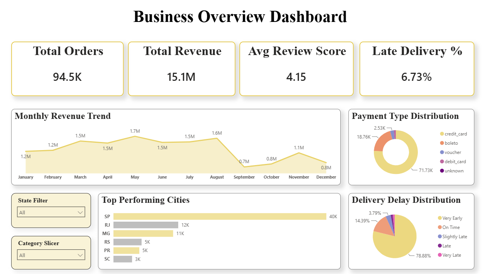
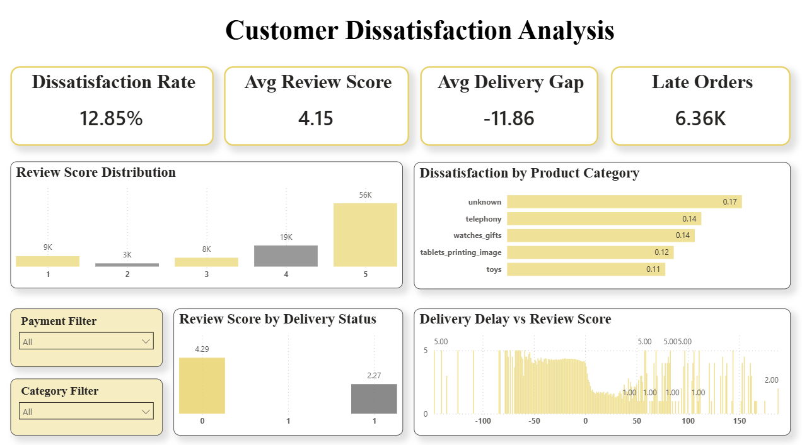
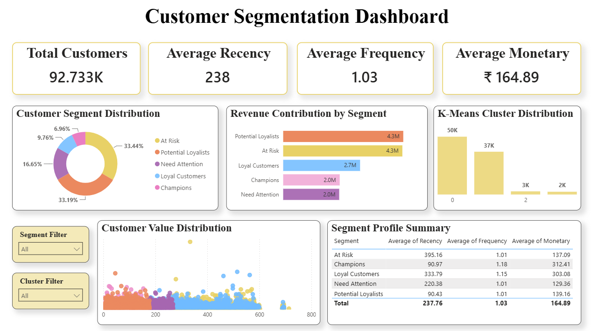

# Customer Dissatisfaction Early Warning System

Live App → https://customer-dissatisfaction-predictior.onrender.com

An end-to-end Machine Learning application that predicts customer dissatisfaction risk in e-commerce orders using order, payment, customer, and delivery performance data. The system combines predictive analytics, explainable AI, customer segmentation, and business intelligence dashboards to help businesses proactively identify at-risk customers before negative reviews occur.

## Overview

Customer satisfaction is one of the most critical success factors in e-commerce. Negative customer experiences often result in poor reviews, reduced retention, and revenue loss.

This project develops a Customer Satisfaction Early Warning System that predicts dissatisfied customers before reviews are submitted. Using the Olist Brazilian E-Commerce Dataset, the system analyzes order, payment, delivery, and product-related information to estimate dissatisfaction probability and provide actionable insights.

The solution integrates:

- Machine Learning Prediction
- Explainable AI (SHAP)
- Customer Segmentation (RFM)
- Business Intelligence Dashboards
- Flask Web Application Deployment

##Tech Stack:

Python • Pandas • NumPy • Matplotlib • Seaborn • Scikit-Learn • Random Forest • XGBoost • SHAP • Power BI • Flask • SQLite • Bootstrap • GitHub • Render

## Dataset

Source: Olist Brazilian E-Commerce Dataset

The project integrates multiple datasets containing customer, order, payment, review, seller, and product information.

### Dataset Summary

- 99,441 delivered orders analyzed
- Multiple datasets merged into a unified master table
- 20 engineered features created
- Customer dissatisfaction target generated using review scores
- Target Variable: `dissatisfied`
- Class imbalance handled through resampling techniques

## Model Performance

| Metric | Score |
|----------|----------|
| Accuracy | XX |
| Precision | XX |
| Recall | XX |
| F1 Score | XX |
| ROC-AUC | XX |

**Recall was prioritized during model selection because identifying dissatisfied customers is more valuable than maximizing overall accuracy.**

## Key Insights

- Delivery Delay Days emerged as one of the strongest predictors of customer dissatisfaction.
- Total Fulfillment Time significantly impacts customer review outcomes.
- Late deliveries substantially increase dissatisfaction probability.
- Larger orders show higher dissatisfaction risk.
- SHAP explainability confirmed operational delays as major business drivers of poor customer experiences.

## Dashboard Highlights

### Business Overview Dashboard

### Customer Satisfaction Analysis Dashboard

### Customer Segmentation Dashboard

## Web Application Features

- Customer Dissatisfaction Prediction
- Real-Time Risk Assessment
- Risk Level Classification
- Explainable AI Insights
- Prediction History Tracking
- Dashboard Integration
- SQLite Logging
